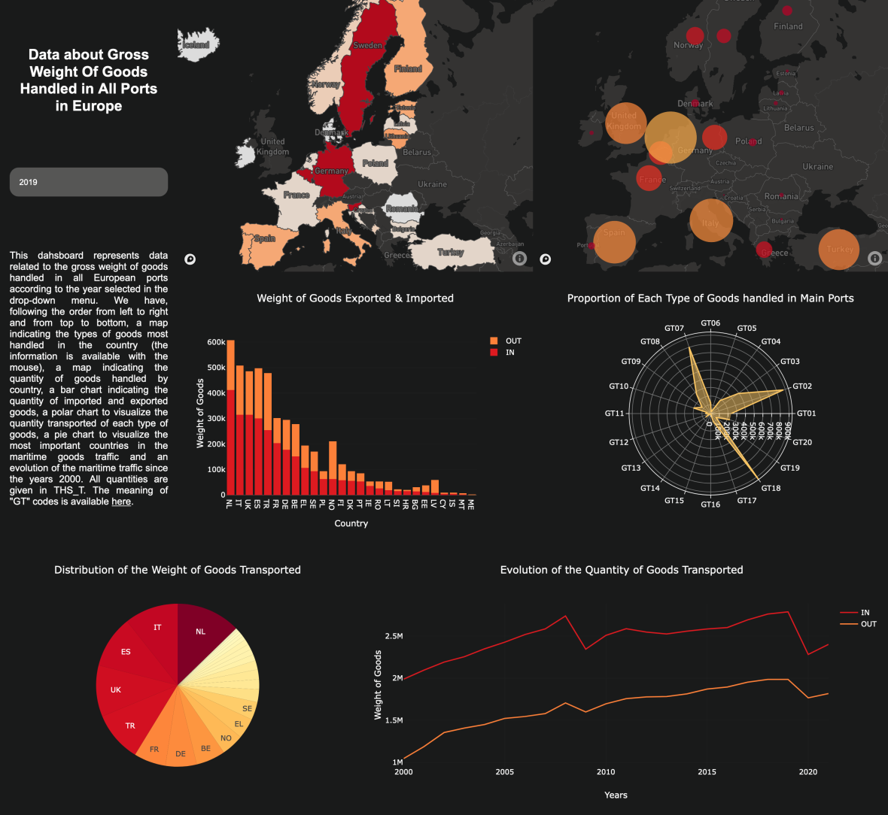

## Preview
This dahsboard represents data related to the gross weight of goods handled in all European ports according to the year selected in the drop-down menu. 
The image below illustrates the general appearence of the dashboard : 



## Installation
 ```bash
 npm install
 npm run dev
 ```

## Approach
Analyzing data on the transportation of maritime goods is important for several reasons. It can help to increase the efficiency and effectiveness of shipping operations, leading to cost savings and improved profitability for the institution. It can also provide valuable insights into global trade patterns and trends, which can help to inform strategic decision-making. Additionally, analyzing data on the transportation of maritime goods can help to identify potential risks and challenges, such as bottlenecks in the supply chain or vulnerabilities in the transportation system, which can then be addressed through targeted interventions. Overall, analyzing data on the transportation of maritime goods is an essential part of ensuring the long-term health and success of an institution.

## Improvements
There are several reasons why it might be interesting to cross-reference data on the transportation of maritime goods with ecological and economic data. By analyzing data on the environmental impact of shipping operations alongside data on the transportation of goods, it is possible to identify opportunities for reducing the environmental footprint of these operations. For example, data on shipping routes and the types of goods being transported could be used to identify opportunities for improving fuel efficiency, reducing emissions, or transitioning to more sustainable modes of transportation. Cross-referencing data on the transportation of maritime goods with economic data can provide valuable insights into the relationship between trade and economic growth. For example, data on the volume and value of goods being shipped could be used to identify opportunities for trade expansion, or to forecast the economic impact of changes in shipping patterns. Finally, cross-referencing data on the transportation of maritime goods with ecological and economic data can also help to identify potential trade-offs or conflicts between different policy goals. For example, data on the environmental impact of shipping operations might be used to identify conflicts between the need to support economic growth and the need to protect the environment. By analyzing these data together, it may be possible to find ways to achieve multiple policy goals simultaneously. The next step of this project is to carry out this cross-referencing of data in order to be able to refine the analysis and thus propose much more relevant graphs.

---


By Axel Hippolite.
